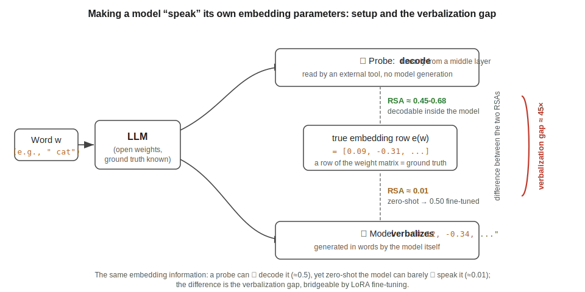

# Speaking One's Own Weights

Code and data for the paper **"Speaking One's Own Weights: The Verbalizability of a Language Model's Token-Embedding Parameters, and Its Limits"** (Su Youyuan, 2026; arXiv link TBD).



**TL;DR.** Can an LLM verbalize, in natural language, the numbers in its own static token-embedding rows? Zero-shot it almost completely fails (RSA ≈ 0.01), even though the information is linearly decodable from its activations (probe upper bound 0.44–0.68) — a *verbalization gap*. LoRA fine-tuning bridges the gap (held-out RSA ≈ 0.50), but a falsification chain — three layers of correlational stripping plus a preregistered causal single-row perturbation — shows the bridged ability is *activation translation + a generic semantics-to-coordinates regression*, *not* introspective access to the model's own parameters: when the queried word is absent from the prompt, editing its embedding row has **exactly zero** causal effect on what the model says.

## What is in this repository

| Path | Contents |
| --- | --- |
| `src/` | Experiment engines: zero-shot probing (`poc.py`), linear-probe ceiling (`probe_ceiling.py`), LoRA verbalization training/eval (`c1_lora.py`, used by experiments C1–C4 and G1–G2 via CLI flags), capability retention (`c5_capability_eval.py`), mixed-target single adapter (`c6_mixed_target.py`), and auxiliary analyses |
| `tools/` | Analysis & reproduction: `analyze_all.py` (recomputes the core result tables from raw data — no GPU, no models, seconds), causal perturbation (`causal_perturb.py`), cross-model 2×2 analyses, baselines, MATLAB figure scripts |
| `run_pending.py`, `run_tonight.py`, `run_extra.py` (+ `run_pending.bat`) | The exact schedulers used to launch every experiment cell, with all hyperparameters spelled out — the authoritative record of what was run. They accreted phase by phase during the project and are **not a polished pipeline**: read them as documentation first, launcher second |
| `results/data/` | **Raw generations** (every word's verbalized text and parsed vector, per seed, `raw/*.jsonl`), PCA targets, per-cell `summary.json`, and logs for all experiments (C0–C7, G1–G3, A/B families) |
| `materials/` | The WordNet synonym/definition dictionaries used by G1 (shipped verbatim for bit-level reproducibility) and the Ogden-850 word list |
| `docs/preregistration_C7_causal_perturbation.md` | The **preregistration record** of the causal experiment (predictions written before running; original, in Chinese) |
| `figures/` | Final paper figures (PNG/PDF/SVG) |

Omitted on purpose (≈33 GB, all regenerable): trained LoRA adapters and optimizer states, and the probe's cached hidden-state tensors (`hidden_states.npz` / `probe_results.npz`).

### Experiment code legend

Directory names under `results/data/` (and the scheduler scripts) use the project's internal experiment codes. Decoder ring:

| Code | Experiment | Paper |
| --- | --- | --- |
| `A*` | Zero-shot "spontaneous confabulation": can the model verbalize embeddings without any training? (`A3` multi-seed main run, `A3-1` persona/system-prompt ablation) | §3 |
| `B*` | Zero-shot floor swept across model scales and families (`B4` = the cross-model sweep) | §3, Appendix B |
| `C0` | Linear-probe decodability ceiling (layer scan, 8 models) | §3 |
| `C1` | LoRA fine-tuning to verbalize **input embeddings** — the main bridging experiment (also hosts the base-checkpoint and Ogden-850 variants) | §3, §6 |
| `C2` | Same, but the target is the orthogonal **unembedding row** ("hard target") | §3 |
| `C3` | Same, but the target is a **mid-layer hidden state** | §3 |
| `C4` | **Cross-model targets**: each model learns to verbalize its own vs. the other model's embeddings (the 2×2 behind the self-specificity analysis) | §4 |
| `C5` | **Capability retention**: five lm-eval tasks before/after fine-tuning | §6 |
| `C6` | **Mixed-target single adapter**: one adapter, two orthogonal parameter spaces | §6 |
| `C7` | **Causal single-row perturbation** (preregistered; the verdict experiment) | §5 |
| `G1` | **Activation cut**: query via WordNet synonyms/definitions so the target word never appears in the prompt | §4 |
| `G2` | **Physical targets** (L2 norm, PCA reconstruction error, token-id binary) + word-frequency baseline | §4 |
| `G3` | Cross-model **static RDM similarity** (shared-geometry baseline) | §4 |

## Recomputing the reported numbers

Despite its name, `tools/analyze_all.py` does **not** cover everything. The honest map has three tiers:

1. **Recomputed from raw generations by `analyze_all.py`** (no GPU, no models, seconds): the C1–C3 bridging tables, multi-seed mean±std, bootstrap 95% CIs, the G2 word-frequency partial correlation, G1 leakage grading and clean-subset residuals, identification accuracy, and the C6 shared-adapter checks. It also *reconciles* (but does not independently recompute) every other cell's `summary.json`.

```bash
pip install numpy scipy nltk
python -c "import nltk; nltk.download('wordnet'); nltk.download('omw-1.4'); nltk.download('brown')"
python tools/analyze_all.py   # -> _analysis_report.md / _analysis.json
# (a pre-generated copy of both outputs ships at the repo root; rerunning overwrites them)
```

2. **Dedicated CPU scripts** (some additionally need the models' embedding matrices on disk): the C4 cross-model 2×2 and the partial-RSA self-specificity with its CI (`tools/analyze_cross_model_specificity.py`, `tools/bootstrap_partial_selfnet.py`), matched-word-set identification (`tools/matched_eval.py`), and the Ogden geometry analysis (`tools/analyze_ogden_geometry.py`).

3. **Read directly from shipped per-cell outputs** (recomputing these means rerunning inference or training on a GPU): the C0 probe ceiling, the A/B-family zero-shot numbers, the C5 capability evaluations, and the C7 causal-perturbation summaries (`results/data/C7_causal_perturb/*_perturb.json`).

Run all commands from the repository root; see `REPRODUCING.md` for the section-by-section map.

## Full retraining (GPU)

Experiments were run on a single laptop GPU (NVIDIA RTX 4060 Laptop, 8 GB VRAM); one fine-tuning cell takes ~40 min.

1. `pip install -r requirements.txt` (Python 3.12; install torch with the CUDA index matching your system).
2. Download the open-weights models into `models/` (see `tools/fetch_curl.py` and the model list in Appendix B of the paper; set `HF_TOKEN` in your environment for gated models — never hard-code it).
3. Sanity-check with `python tools/verify_load.py` and `python tools/inspect_models.py`.
4. Launch cells via `python run_pending.py` / `run_tonight.py` (they encode the exact per-cell hyperparameters), or call `src/c1_lora.py` directly.
5. The causal experiment: `python tools/causal_perturb.py` (pure inference on a frozen adapter; see the preregistration in `docs/`).

See `REPRODUCING.md` for a map from each paper section/figure/table to the commands and data cells behind it.

## Citation

```bibtex
@misc{su2026speaking,
  title  = {Speaking One's Own Weights: The Verbalizability of a Language Model's Token-Embedding Parameters, and Its Limits},
  author = {Su, Youyuan},
  year   = {2026},
  note   = {arXiv preprint, to appear}
}
```

## License

Code is released under the MIT License (see `LICENSE`). The raw experiment data in `results/` and `materials/` may be used under CC BY 4.0 with attribution to the paper.
